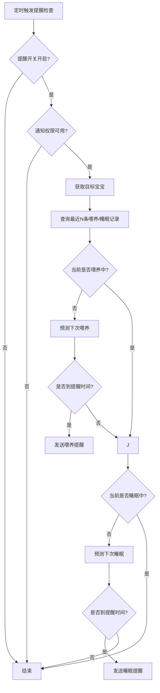
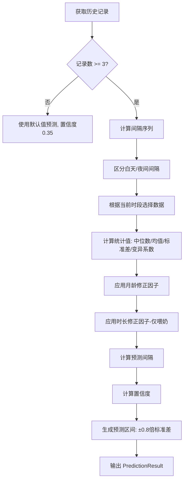

./gradlew updateAllLanguages
./gradlew generateLanguageJson
./gradlew fetchInternationalLanguageList
conda activate test

## 计时逻辑说明

### 统一组件
- 使用 `RecordView` 作为计时器展示，三态：INIT → RECORDING → PAUSE。
- 时间输入使用 `TimeEditText`，输入 4 位数字自动格式化为 `MM-dd HH:mm:ss`，并做跨天与未来时间校验。

### 喂奶/睡眠（FeedingRecord/SleepRecord）
- INIT → RECORDING：若已填写开始时间，用当前时间与开始时间计算偏移；清空结束时间；启动后回填开始时间，并更新结束时间参考时间戳（用于跨天判断）。
- RECORDING → PAUSE：结束时间自动填当前时间，记录 `pausedEndTimestamp`。
- PAUSE → RECORDING：若结束时间被手动修改过，弹确认；确认后清空结束时间并继续计时。
- 手动改开始时间：清空结束时间、重置计时器、更新结束时间参考时间戳。
- 手动改结束时间：强制暂停计时器，校验时间区间并显示时长。
- 时长显示：通过 `RecordView.showDurationWithoutTimer()` 显示“手动时间差”。
- 进行中状态：喂奶/睡眠使用 `OngoingRecordManager` 记录进行中状态并支持恢复。

### 事件记录（EventRecord，带时长事件）
- 布局与喂奶/睡眠一致：`RecordView` + `TimeEditText` 的开始/结束时间输入。
- INIT → RECORDING：按已填开始时间计算偏移，清空结束时间，回填开始时间并更新参考时间戳。
- RECORDING → PAUSE：结束时间填当前时间，记录 `pausedEndTimestamp`，并显示时长。
- PAUSE → RECORDING：若结束时间被手动修改过，弹确认；确认后清空结束时间并继续计时。
- 手动改开始/结束时间：逻辑与喂奶/睡眠一致（重置计时器、校验时间区间、更新时长）。

## 首页业务逻辑（喂奶/睡眠/预测）

### 数据流与刷新节奏
- 页面可见时触发 `DashboardViewModel.loadDashboardData()` 拉取数据，页面隐藏/暂停时停止定时刷新。
- 数据源来自：当天喂奶/睡眠记录、与当天重叠的记录（跨天统计用）、最近 N 条记录（预测用）、进行中状态（`OngoingRecordManager`）。
- 两类定时器：
  - 每秒：刷新状态卡的实时计时（喂奶/睡眠持续、醒着时长）。
  - 每分钟：刷新“距上次”、预测剩余、进行中今日累计。

### 喂奶逻辑
- 进行中状态由 `OngoingRecordManager` 持久化，页面恢复时可继续计时与显示。
- 状态卡（喂奶中）按开始时间实时显示持续时长，每秒更新。
- “距上次喂奶”基于最近一次喂奶结束时间计算，并每分钟刷新。
- 今日统计：
  - 次数：当天记录数。
  - 时长：按“与当天重叠时长”统计，跨天记录会被截断到当天区间。
  - 若正在喂奶，今日时长会叠加“从今天零点到当前”的进行中时长。

### 睡眠逻辑
- 状态卡（睡觉中）显示实时睡眠时长；醒着时显示“距上次醒来”时长。
- “距上次睡觉”基于最近一次睡眠结束时间计算，并每分钟刷新。
- 今日统计：
  - 次数：当天记录数。
  - 时长：按“与当天重叠时长”统计，跨天记录会被截断到当天区间。
  - 若正在睡觉，今日时长会叠加“从今天零点到当前”的进行中时长。

### 预测逻辑
- 预测入口：`PredictionManager`，内部统一将历史记录按开始时间升序排序，避免间隔计算错误。
- 预测输出：时间区间（最早/最晚）+ 置信度；展示时显示区间与“最晚还剩”时间。
- 过期判断以“最晚时间”作为基准，避免中心点已过但区间仍有效导致误判。
- 若预测过期，分钟定时器触发数据刷新并重新预测。

### 流程图
```mermaid
flowchart TB
    A[页面可见/恢复] --> B[refreshData]
    B --> C[DashboardViewModel.loadDashboardData]
    C --> D[查询当天记录]
    C --> E[查询当天重叠记录]
    C --> F[查询最近N条记录]
    C --> G[读取进行中状态]
    D --> H[今日次数]
    E --> I[今日时长(跨天截断)]
    F --> J[PredictionManager]
    J --> K[预测时间区间/置信度]
    G --> L[状态卡/进行中起止]
    H --> M[UI更新]
    I --> M
    K --> M
    L --> M

    M --> N[每秒计时刷新]
    M --> O[每分钟刷新: 距上次/预测剩余/进行中今日累计]
```

### 提醒通知流程图


---

## 预测功能详细设计

### 整体架构

项目采用**策略模式**设计预测功能，支持未来扩展不同预测策略（如云端ML模型、A/B测试等）。

```
┌─────────────────────────────────────────────────────────────┐
│                     调用方（2个场景）                          │
├─────────────────────────────────────────────────────────────┤
│  1. DashboardViewModel.loadDashboardData()  - 首页展示       │
│  2. ReminderNotifier.checkAndNotify()       - 后台提醒通知   │
└─────────────────────────────┬───────────────────────────────┘
                              │
                              ▼
┌─────────────────────────────────────────────────────────────┐
│              PredictionManager (统一入口)                    │
│  - predictNextFeeding(): 预测下次喂奶                         │
│  - predictNextSleep(): 预测下次睡眠                           │
│  - 自动按开始时间升序排列记录，避免调用方传入DESC导致间隔计算错误   │
└─────────────────────────────┬───────────────────────────────┘
                              │
                              ▼
┌─────────────────────────────────────────────────────────────┐
│                  Predictor (策略接口)                         │
│  定义 predictNextFeeding / predictNextSleep 方法             │
└─────────────────────────────────────────────────────────────┘
                              ▲
                              │ 实现
                              │
┌─────────────────────────────────────────────────────────────┐
│              LocalRulePredictor (本地规则引擎)                │
│  基于统计规则+科学依据进行预测，无网络，隐私友好                  │
└─────────────────────────────────────────────────────────────┘
```

### 预测结果数据结构 (PredictionResult)

| 字段 | 类型 | 说明 |
|------|------|------|
| `predictedTime` | Date | 预测的时间点（中心点） |
| `confidence` | Float | 置信度 (0.0 - 1.0) |
| `earliestTime` | Date | 预测区间 - 最早时间 |
| `latestTime` | Date | 预测区间 - 最晚时间 |
| `source` | enum | 预测来源：`LOCAL_RULE` / `POPULATION_STATS` / `CLOUD_ML` / `ENSEMBLE` |

**置信度等级 (ConfidenceLevel)**：
- `HIGH` (≥0.8): 规律明显，数据充足
- `MEDIUM` (≥0.6): 有一定规律
- `LOW` (≥0.4): 数据较少或规律不明显
- `VERY_LOW` (<0.4): 几乎无法预测

### LocalRulePredictor 核心算法

#### 1. 数据要求
- 最少需要 **3条记录** 才进行规则预测
- 不足时使用**默认值预测**（冷启动，置信度 0.35）

#### 1.1 时间衰减 (EWMA)
- 使用**指数加权移动平均**替代简单中位数，最近记录权重更高
- 平滑系数 `α = 0.3`，更快适应宝宝作息变化
- 公式：`S_t = α × X_t + (1-α) × S_{t-1}`

#### 2. 默认间隔值（按月龄）

**喂奶默认间隔**:
| 月龄 | 间隔 |
|------|------|
| 0-1个月 | 2.5小时 |
| 2-3个月 | 3小时 |
| 4-5个月 | 3.5小时 |
| 6个月+ | 4小时 |

**清醒窗口（睡眠间隔）**:
| 月龄 | 清醒窗口 |
|------|---------|
| 0个月 | 45分钟 |
| 1个月 | 1小时 |
| 2个月 | 1.25小时 |
| 3个月 | 1.5小时 |
| 4-5个月 | 2小时 |
| 6个月+ | 2.5小时 |

#### 3. 预测流程



#### 4. 时段划分
- 白天：6:00 - 20:00
- 夜间：20:00 - 次日6:00
- 预测时根据当前时段选择对应的历史数据，优先使用同时段数据

#### 5. 修正因子

**月龄修正（喂奶）**:
| 月龄 | 因子 | 说明 |
|------|------|------|
| 0-1月 | ×0.9 | 新生儿更频繁 |
| 2-3月 | ×0.95 | - |
| 4-5月 | ×1.0 | 基准 |
| 6-8月 | ×1.05 | - |
| 9月+ | ×1.1 | 间隔更长 |

**月龄修正（睡眠）**:
| 月龄 | 因子 | 说明 |
|------|------|------|
| 0-1月 | ×0.85 | 清醒窗口短 |
| 2-3月 | ×0.95 | - |
| 4-5月 | ×1.0 | 基准 |
| 6月+ | ×1.1 | 清醒窗口长 |

**时长修正（喂奶）**:
| 条件 | 因子 | 说明 |
|------|------|------|
| 喂奶时长 > 平均×1.3 | ×1.08 | 喂得久，间隔延长 |
| 喂奶时长 < 平均×0.7 | ×0.92 | 喂得短，间隔缩短 |
| 其他 | ×1.0 | 正常 |

**时长修正（睡眠）**:
| 条件 | 因子 | 说明 |
|------|------|------|
| 小睡时长 > 平均×1.3 | ×1.10 | 睡得久，清醒窗口延长 |
| 小睡时长 < 平均×0.7 | ×0.88 | 睡得短，清醒窗口缩短 |
| 其他 | ×1.0 | 正常 |

#### 6. 置信度计算

```
基础置信度 = 0.45

+ 数据量加成: min(记录数 × 0.025, 0.25)     // 最多+25%
+ 规律性加成（基于变异系数）:
  - CV < 0.15: +0.2  (非常规律)
  - CV < 0.25: +0.1  (较规律)
  - CV < 0.35: +0.0  (一般)
  - CV >= 0.35: -0.1 (不规律)
+ 数据充足加成: 时段记录数 >= 5 时 +0.05

最终置信度 = clamp(计算值, 0.2, 0.9)
```

### UI 展示逻辑 (DashboardFragment)

1. **预测卡片展示**:
   - 显示时间区间: "下次喂奶 10:30~11:00"
   - 显示剩余时间: "还剩 1小时20分"
   - 根据置信度调整文字透明度: `alpha = 0.5 + confidence × 0.5`

2. **刷新机制**:
   - 页面可见时: 调用 `DashboardViewModel.loadDashboardData()` 获取预测
   - 每分钟更新: 通过 `updatePredictionRemainTime()` 刷新剩余时间
   - 预测过期时: 自动触发 `refreshData()` 重新预测

3. **过期判断**:
   - 以 `latestTime`（区间最晚时间）作为基准
   - `isExpired() = latestTime < currentTime`

### 提醒通知逻辑 (ReminderNotifier)

**触发条件**:
1. 提醒开关开启
2. 通知权限可用
3. 当前无对应的进行中记录
4. 距上次提醒 >= 2小时（冷却期）
5. 当前时间 >= 预测的最晚时间

**防误触发机制**:
- 预测时间早于上次结束时间则视为无效
- 有进行中记录时跳过对应提醒
- 无预测结果时使用回退间隔（喂养3小时/睡眠4小时）

### 数据安全与边界处理

为确保预测算法的健壮性，`LocalRulePredictor` 包含以下安全机制：

#### 1. 记录过滤
- **进行中记录**：过滤 `feedingEnd <= feedingStart` 的记录，避免使用未完成的记录进行预测
- **异常记录**：跳过结束时间早于开始时间的无效数据

#### 2. 时段数据回退
- 当白天/夜间某时段记录数少于3条时，自动合并两个时段数据
- 避免因数据稀疏导致预测失败

#### 3. 区间保护
- **最小区间**：即使标准差为0（完全规律作息），预测区间最小为5分钟
- 避免区间退化为单点影响用户体验

#### 4. 数值安全
- 时长计算强制非负：`coerceAtLeast(0L)`
- 变异系数边界处理：`mean <= 0` 时返回 `Double.MAX_VALUE` 降低置信度

### 相关文件清单

| 文件 | 路径 | 职责 |
|------|------|------|
| PredictionManager | `app/.../home/prediction/` | 预测统一入口，管理预测策略 |
| Predictor | `app/.../home/prediction/` | 预测器接口定义 |
| LocalRulePredictor | `app/.../home/prediction/` | 本地规则预测器实现 |
| PredictionResult | `app/.../home/prediction/` | 预测结果数据模型 |
| LocalRulePredictorTest | `app/.../prediction/` (test) | 预测器单元测试（10个用例） |
| DashboardViewModel | `app/.../home/` | 首页ViewModel，调用预测 |
| DashboardFragment | `app/.../home/` | 首页UI，展示预测结果 |
| DashboardData | `app/.../home/bean/` | 首页数据模型，包含预测字段 |
| ReminderNotifier | `app/.../reminder/` | 后台提醒，基于预测触发通知 |

