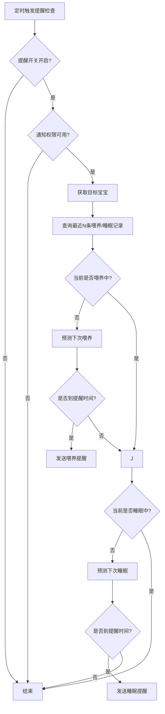

./gradlew updateAllLanguages
./gradlew generateLanguageJson
./gradlew fetchInternationalLanguageList
conda activate test

## 计时逻辑说明

### 统一组件
- 使用 `RecordView` 作为计时器展示，三态：INIT → RECORDING → PAUSE。
- 时间输入使用 `TimeEditText`，输入 4 位数字自动格式化为 `MM-dd HH:mm:ss`，并做跨天与未来时间校验。

### 喂奶/睡眠（FeedingRecord/SleepRecord）
- INIT → RECORDING：若已填写开始时间，用当前时间与开始时间计算偏移；清空结束时间；启动后回填开始时间，并更新结束时间参考时间戳（用于跨天判断）。
- RECORDING → PAUSE：结束时间自动填当前时间，记录 `pausedEndTimestamp`。
- PAUSE → RECORDING：若结束时间被手动修改过，弹确认；确认后清空结束时间并继续计时。
- 手动改开始时间：清空结束时间、重置计时器、更新结束时间参考时间戳。
- 手动改结束时间：强制暂停计时器，校验时间区间并显示时长。
- 时长显示：通过 `RecordView.showDurationWithoutTimer()` 显示“手动时间差”。
- 进行中状态：喂奶/睡眠使用 `OngoingRecordManager` 记录进行中状态并支持恢复。

### 事件记录（EventRecord，带时长事件）
- 布局与喂奶/睡眠一致：`RecordView` + `TimeEditText` 的开始/结束时间输入。
- INIT → RECORDING：按已填开始时间计算偏移，清空结束时间，回填开始时间并更新参考时间戳。
- RECORDING → PAUSE：结束时间填当前时间，记录 `pausedEndTimestamp`，并显示时长。
- PAUSE → RECORDING：若结束时间被手动修改过，弹确认；确认后清空结束时间并继续计时。
- 手动改开始/结束时间：逻辑与喂奶/睡眠一致（重置计时器、校验时间区间、更新时长）。

## 首页业务逻辑（喂奶/睡眠/预测）

### 数据流与刷新节奏
- 页面可见时触发 `DashboardViewModel.loadDashboardData()` 拉取数据，页面隐藏/暂停时停止定时刷新。
- 数据源来自：当天喂奶/睡眠记录、与当天重叠的记录（跨天统计用）、最近 N 条记录（预测用）、进行中状态（`OngoingRecordManager`）。
- 两类定时器：
  - 每秒：刷新状态卡的实时计时（喂奶/睡眠持续、醒着时长）。
  - 每分钟：刷新“距上次”、预测剩余、进行中今日累计。

### 喂奶逻辑
- 进行中状态由 `OngoingRecordManager` 持久化，页面恢复时可继续计时与显示。
- 状态卡（喂奶中）按开始时间实时显示持续时长，每秒更新。
- “距上次喂奶”基于最近一次喂奶结束时间计算，并每分钟刷新。
- 今日统计：
  - 次数：当天记录数。
  - 时长：按“与当天重叠时长”统计，跨天记录会被截断到当天区间。
  - 若正在喂奶，今日时长会叠加“从今天零点到当前”的进行中时长。

### 睡眠逻辑
- 状态卡（睡觉中）显示实时睡眠时长；醒着时显示“距上次醒来”时长。
- “距上次睡觉”基于最近一次睡眠结束时间计算，并每分钟刷新。
- 今日统计：
  - 次数：当天记录数。
  - 时长：按“与当天重叠时长”统计，跨天记录会被截断到当天区间。
  - 若正在睡觉，今日时长会叠加“从今天零点到当前”的进行中时长。

### 预测逻辑
- 预测入口：`PredictionManager`，内部统一将历史记录按开始时间升序排序，避免间隔计算错误。
- 预测输出：时间区间（最早/最晚）+ 置信度；展示时显示区间与“最晚还剩”时间。
- 过期判断以“最晚时间”作为基准，避免中心点已过但区间仍有效导致误判。
- 若预测过期，分钟定时器触发数据刷新并重新预测。

### 流程图
```mermaid
flowchart TB
    A[页面可见/恢复] --> B[refreshData]
    B --> C[DashboardViewModel.loadDashboardData]
    C --> D[查询当天记录]
    C --> E[查询当天重叠记录]
    C --> F[查询最近N条记录]
    C --> G[读取进行中状态]
    D --> H[今日次数]
    E --> I[今日时长(跨天截断)]
    F --> J[PredictionManager]
    J --> K[预测时间区间/置信度]
    G --> L[状态卡/进行中起止]
    H --> M[UI更新]
    I --> M
    K --> M
    L --> M

    M --> N[每秒计时刷新]
    M --> O[每分钟刷新: 距上次/预测剩余/进行中今日累计]
```

### 提醒通知流程图

